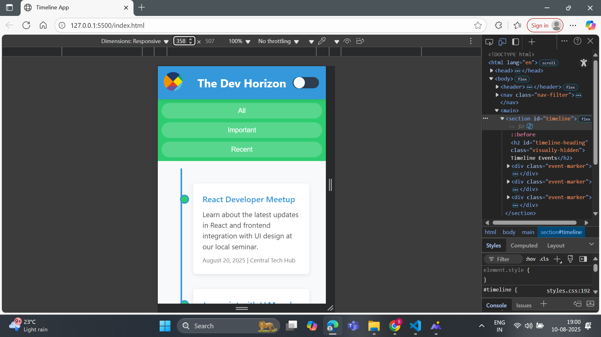
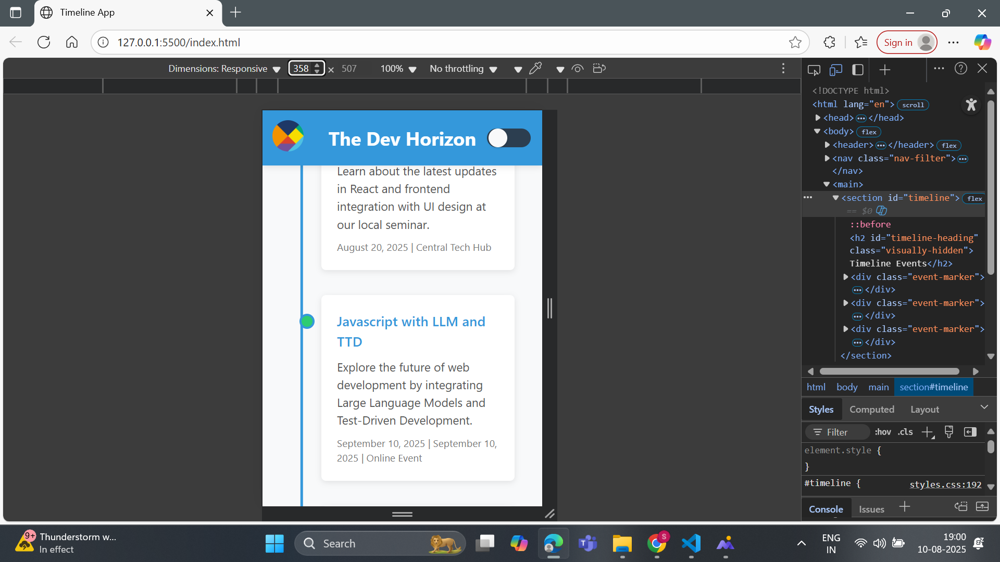
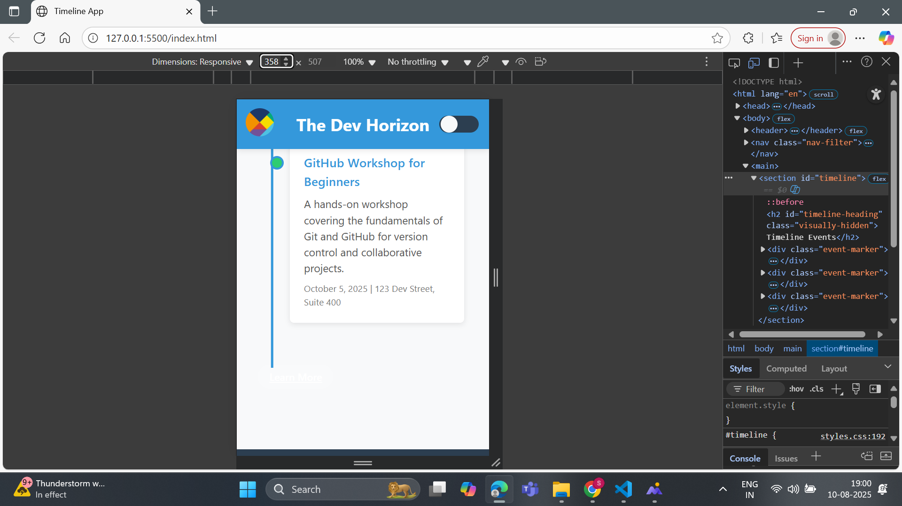
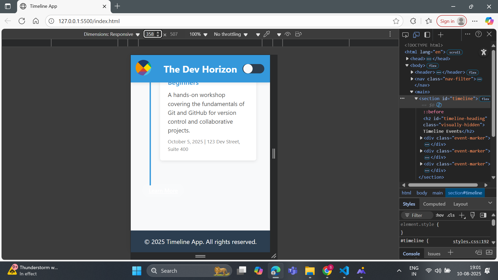
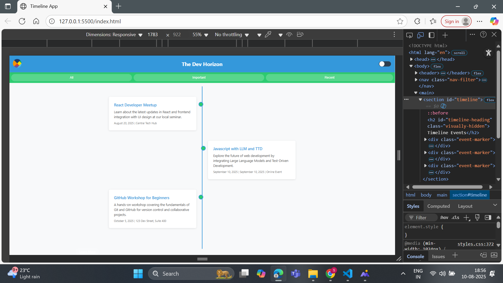
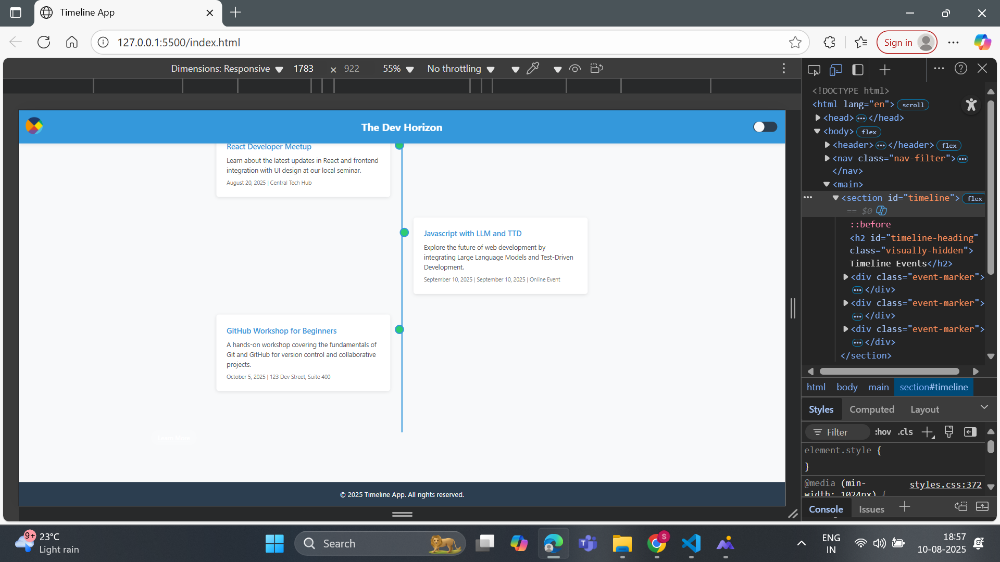
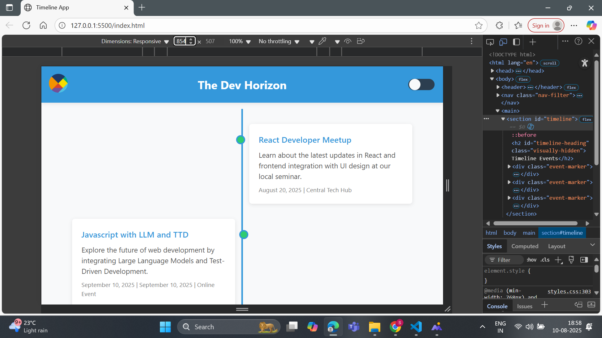
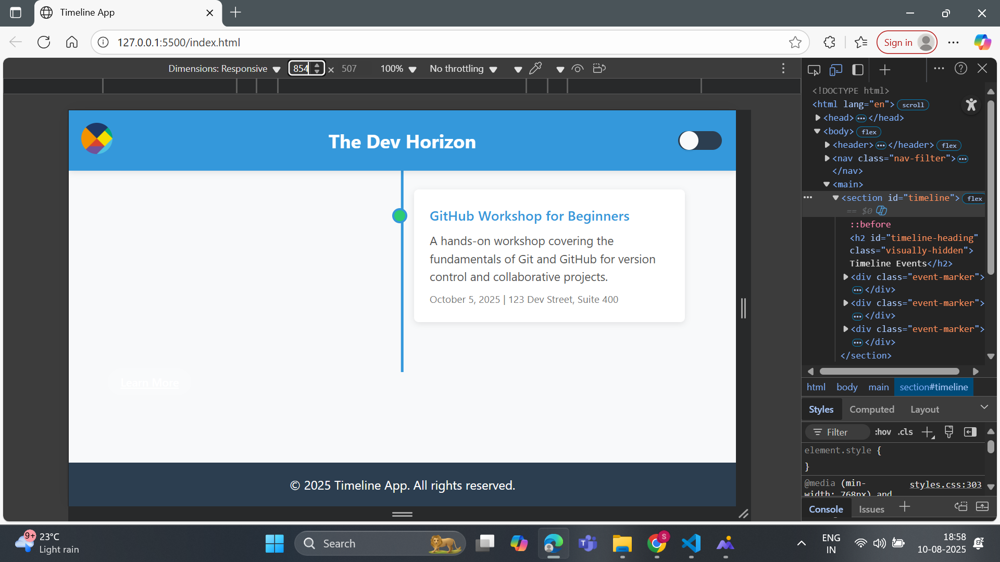

# Event Timeline Project

A clean timeline display for showing upcoming events.

# How to Use

1. Download the project folder
2. Open index.html in any modern browser
3. The timeline will show sample events
4. Use the theme toggle in top-right corner

## What's Included

- Main timeline page (index.html)
- CSS styling (styles.css)
- Sample event data
- Logo image

## Custom Colors

To change colors, edit these lines in styles.css:

## Main Colors

--primary-color: #3498db; /_ Blue _/
--secondary-color: #2ecc71; /_ Green _/

## Screenshots

Mobile View:

Desktop View:

Tablet View:

## Known Issues

- Theme toggle doesn't save preference
- Filter buttons not functional yet

--Made by:Boinapalli Sri Shruthi
