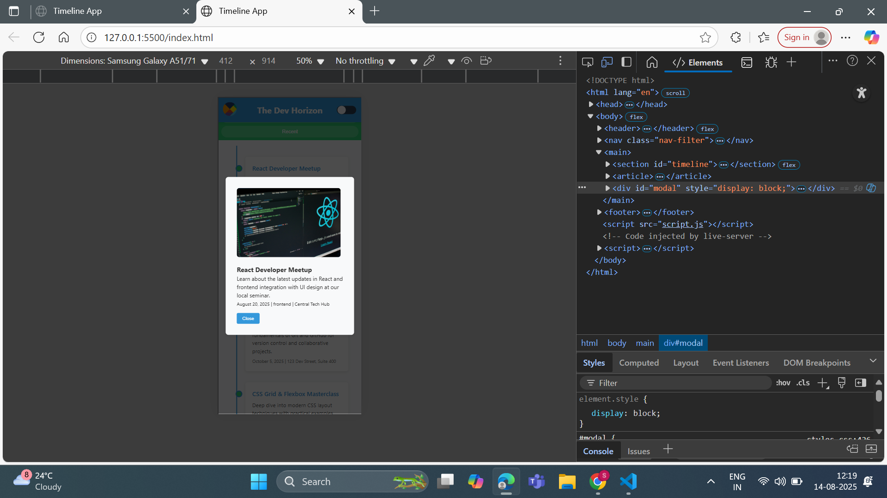
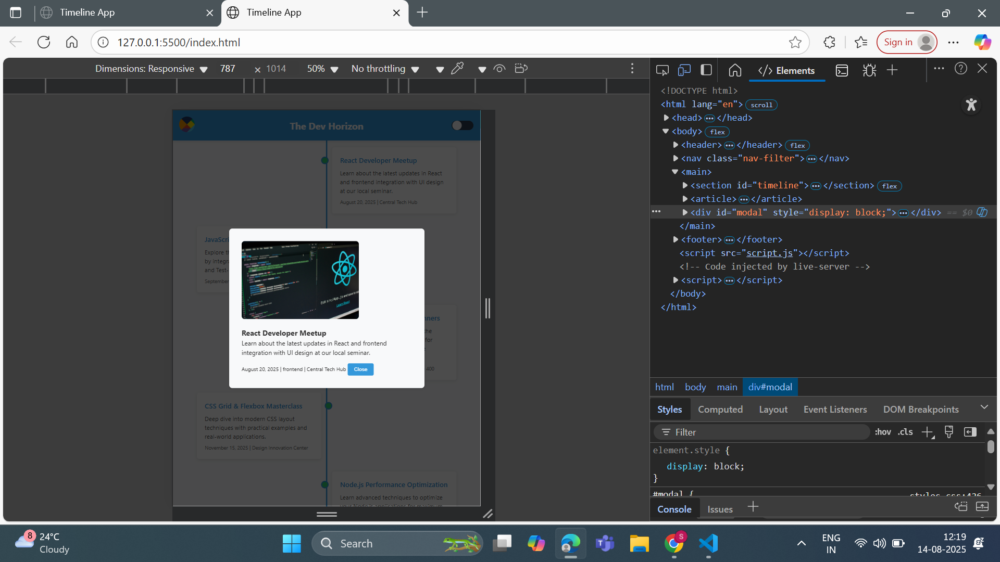
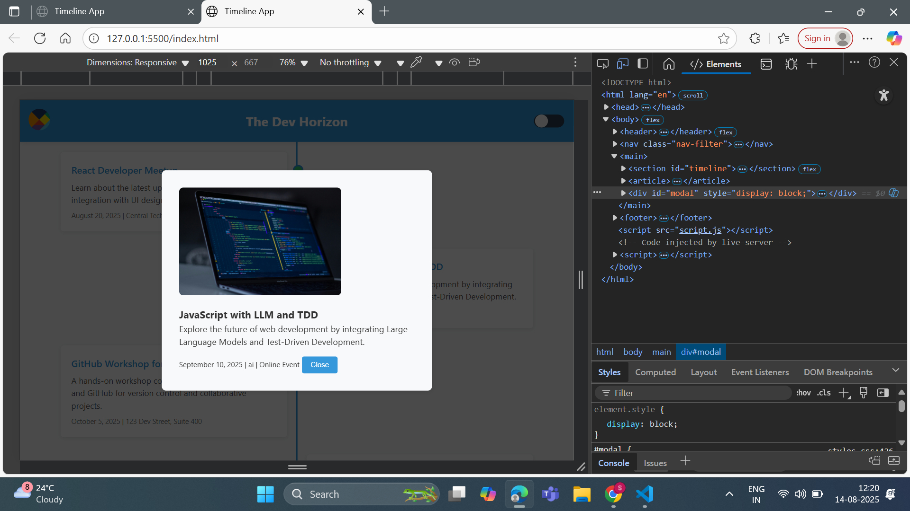

# Timeline App – Task 3

## Overview

This is the **Task-3** implementation of the Timeline App.  
In this stage, interactivity is added using **Vanilla JavaScript**. The application now loads events dynamically from a JSON file, renders them into the timeline, and opens a modal with event details when an event is clicked. The modal can also be closed by the user.

---

## Features Implemented in Task-3

- Added `data/events.json` containing 8+ sample events with:
  - year
  - title
  - description
  - imageURL
  - category
- **Dynamic event rendering** into `#timeline` using `fetch()`.
- **Click handlers** to open the modal with detailed event info.
- **Close functionality** for the modal.
- `index.html` updated to load `script.js` at the end of `<body>`.

---

## Screenshots – Task-3

### Mobile View – Modal Open

### Tablet View – Modal Open

### Desktop View – Modal Open

---

## How to Run

1. Clone the repository:

git clone https://github.com/srishruthib/js-school-project-BoinapalliSriShruthi.git
cd js-school-project-BoinapalliSriShruthi
